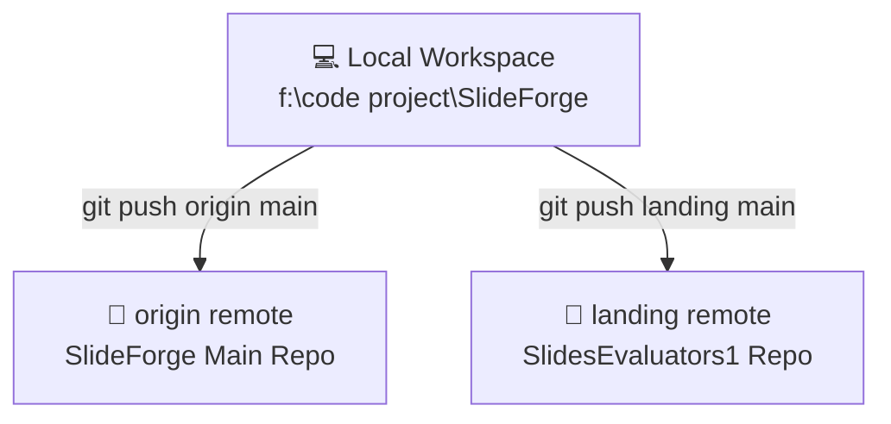
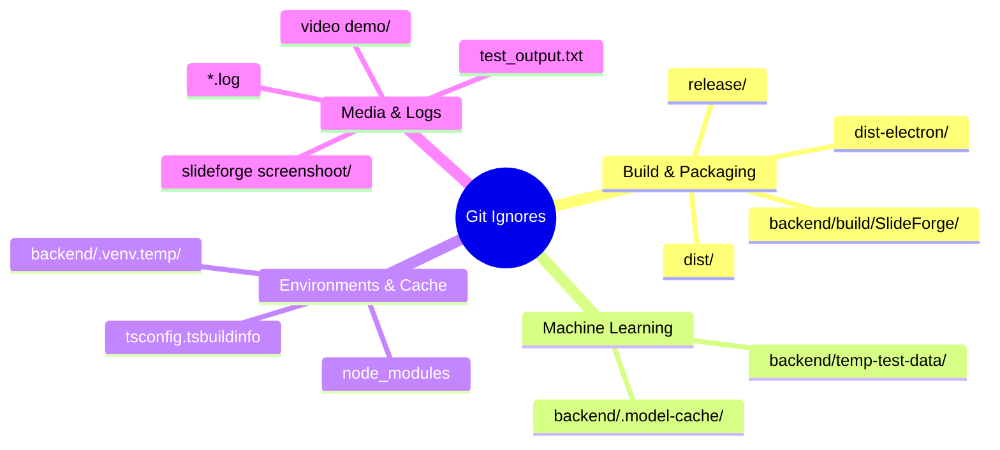

# SlideForge Git Workflow Guide

Welcome to the **SlideForge Git Workflow & Best Practices Documentation**. Since SlideForge is a complex, multi-technology application (Vite/React frontend, FastAPI Python backend, and Electron desktop shell) integrated with multiple GitHub remotes, following a clean version control strategy is essential to avoid repository bloat, build failures, or sync issues.

This document details how SlideForge uses Git, maintains multiple remotes, avoids tracking huge machine learning assets or PyInstaller binaries, and syncs code correctly.

---

## 🗺️ Multi-Remote Architecture

SlideForge currently maintains two distinct upstream GitHub repositories to sync the main codebase and deployment targets:



### Remotes Setup

| Remote Name | Repository URL | Purpose |
| :--- | :--- | :--- |
| **`origin`** | `https://github.com/arpanguria083-ux/SlideForge.git` | Main development, repository backup, and frontend/backend code version control. |
| **`landing`** | `https://github.com/arpanguria083-ux/SlidesEvaluators1.git` | Deployment target, evaluators' workspace, and production releases. |

### Inspecting Remotes
To verify your current remotes, run:
```bash
git remote -v
```
You should see:
```text
landing  https://github.com/arpanguria083-ux/SlidesEvaluators1.git (fetch)
landing  https://github.com/arpanguria083-ux/SlidesEvaluators1.git (push)
origin   https://github.com/arpanguria083-ux/SlideForge.git (fetch)
origin   https://github.com/arpanguria083-ux/SlideForge.git (push)
```

---

## 🧹 The Exclusion Strategy (.gitignore)

To prevent gigabytes of temporary data, virtual environments, and generated machine learning model files from bloating our repository history, a comprehensive ignore strategy is implemented.

> [!IMPORTANT]
> **NEVER** commit Python virtual environments, compiled PyInstaller binaries, or downloaded Hugging Face model weights. These should remain strictly local.

### Key Exclusions in `.gitignore`

Here are the specific directories that **must never** be added to the repository:



### Summary of Rules
* **ML Cache**: `backend/.model-cache/` contains deep learning weights (Surya, OCR, PyTorch) that are downloaded dynamically during runtime.
* **Packaging Outputs**: `release/` and `dist/` hold multi-hundred MB installers and electron shells.
* **PyInstaller Intermediate builds**: `backend/build/SlideForge/` holds compilation files of PyInstaller which generate hundreds of thousands of lines of code.

---

## 🚀 Standard Workflow

Follow these steps for regular development and syncing:

### 1. Stage Code Selectively
Avoid using raw `git add .` unless you have run `git status` first to ensure no unwanted files are marked for commit.
```bash
# Verify modified and untracked files
git status

# Stage all valid changes (respecting .gitignore)
git add .
```

### 2. Craft Quality Commit Messages
Use structured and descriptive messages. This makes it easy to track complex features across front/back ends.
```bash
git commit -m "feat: implement OCR asset manager, add OcrSettingsPanel components, and update preflight checks"
```

### 3. Synchronize with Both Remotes
To push your commits to both your main development repository and your landing repository, push to both remotes sequentially:
```bash
# Push to main development repository
git push origin main

# Push to release/landing repository
git push landing main
```

---

## 🔧 Troubleshooting & Advanced Recipes

### 🚨 Problem 1: Unwanted heavy files were tracked in the past
If massive binaries or directories (like `backend/build/SlideForge/`) were previously committed and continue to show up in `git status` even after adding them to `.gitignore`, they must be removed from the Git index (cache) without deleting them from your local hard drive.

**The Fix:**
```bash
# Remove from git cache recursively
git rm --cached -r backend/build/SlideForge/

# Commit the removal
git commit -m "chore: untrack build files and keep local copies"

# Push the fix
git push origin main
git push landing main
```

### ⚠️ Problem 2: CR/LF Newline Warnings
On Windows, you may encounter warnings like:
`warning: LF will be replaced by CRLF in file_path.ts`

**The Fix:**
This is completely normal when working across Windows (CRLF) and Linux/macOS (LF) environments. To configure Git to handle line endings automatically:
```bash
# Auto-convert CRLF on checkout, LF on commit
git config --global core.autocrlf true
```

### 🔄 Problem 3: Synced changes are out of order
If your local repository is out of sync with one of the remotes, fetch all remotes first and then rebase:
```bash
# Fetch updates from all remotes
git fetch --all

# Rebase local main on top of origin master/main
git rebase origin/main
```

---

## 📈 Branching Strategy

Currently, the primary branches used are:
* **`main`**: The primary operational branch, housing stable updates, settings UI modules, and preflight scripts.
* **`master`**: The legacy/historical tracking branch mapped to `origin/master`.

For new experimental features (e.g. adding new OCR engines or local LLM interfaces), it is highly recommended to work on a feature branch:
```bash
# Create and switch to feature branch
git checkout -b feat/new-ocr-engine

# Merge into main when complete
git checkout main
git merge feat/new-ocr-engine
```
